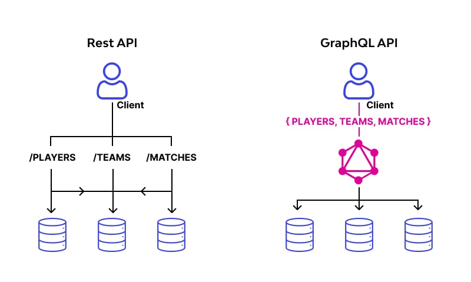

# GraphQL Server

**GraphQL** adalah bahasa query untuk API dan runtime untuk menjalankan query tersebut dengan menggunakan tipe data yang kita definisikan. GraphQL memungkinkan kita untuk menentukan tipe data yang kita inginkan, dan mendapatkan data tersebut dalam satu kali request.

[Dokumentasi GraphQL](https://graphql.org/learn/)

## GraphQL vs REST API
Lebih bagus mana antara GraphQL & REST API? Jawabannya, **tergantung**.

**REST API** lebih baik untuk aplikasi yang sederhana, sedangkan **GraphQL** lebih baik untuk aplikasi yang kompleks. 



- **GraphQL** memungkinkan kita untuk mendapatkan data yang kita butuhkan dalam satu kali request
- **REST API** memerlukan beberapa kali request untuk mendapatkan data yang kita butuhkan.

## Kapan dan kenapa menggunakan GraphQL?
- **Ketika aplikasi kita kompleks**, kita memerlukan GraphQL untuk mendapatkan data yang kita butuhkan dalam satu kali request.
- **Ketika aplikasi kita memerlukan performa yang baik**, kita memerlukan GraphQL untuk mengoptimalkan request yang kita kirimkan ke server.
- **Ketika aplikasi kita memerlukan dokumentasi yang baik**, kita memerlukan GraphQL untuk mendokumentasikan tipe data yang kita gunakan.

## Demo GraphQL Server
Kita akan menggunakan **Apollo Server** untuk membuat GraphQL server.

Apa itu **Apollo Server**? Apollo Server adalah library yang digunakan untuk mempermudah kita membuat GraphQL server.

[Dokumentasi Apollo Server](https://www.apollographql.com/docs/apollo-server/getting-started)

### Schema
---
Schema adalah deskripsi data yang kita punya, biasanya kita membuat sebuah schema dengan menggunakan nama variable **typeDefs**.
<br>
```js
// Schema, berisi deskripsi data yang kita punya
const typeDefs = `#graphql
  # Untuk menulis komen di graphql, gunakan "#"
  # "Book" type untuk mendefinisikan kolom yang bisa kita dapatkan lewat query untuk semua buku dari data kita.

  type Book {
    id : ID 
    title: String
    author: String
  }

  # "Query" type untuk mendifinisikan query /entry point yang bisa diakses oleh client, dalam hal ini query "books" yang akan mengembalikan array dari "Book" type.
  # GET
  type Query {
    books: [Book]
    book(bookId : ID) : Book
  }
`
```
[Dokumentasi Schema](https://www.apollographql.com/docs/apollo-server/schema/schema)

### Resolver
---
Resolver adalah fungsi yang digunakan untuk mengambil data dari database atau sumber data lainnya. Resolver seperti controller (REST API), semua logic yang berhubungan untuk mendapatkan data yang dibutuhkan ada disini

```js
const resolvers = {
    Query: {
        books: () => {
            // your logic

            return books
        },
        book: (parent, args, contextValue, info) => {
            // cara dapetin ID nya gimana?
            // by default, setiap resolver menerima 4 parameter
            const { bookId } = args

            const book = books.find((el) => el.id === +bookId)

            return book
        }
    },
};
```
[Dokumentasi Resolver](https://www.apollographql.com/docs/apollo-server/data/resolvers)


### Mutation Type (Modif data)
---
Dengan contoh diatas, kita sudah belajar bagaimana membuat schema dan resolver yang memiliki fitur **Find All** & **Find By ID**. Kita akan belajar untuk memodifikasi data yang ada di server kita dengan menggunakan **Mutation type**

- Schema :
```js
const typeDefs = `#graphql
  # "Mutation" type untuk memodifikasi data yang ada di server, dalam hal ini menambahkan data baru ke dalam server.
  # POST / PUT / PATCH / DELETE
  type Mutation {
    addBook(title: String, author: String): Book
  }
`
```

- Resolver :
```js
const resolver = {
    Mutation: {
        addBook: (parent, args, contextValue, info) => {
            const { title, author } = args

            const newBook = {
                id: books.length + 1,
                title,
                author
            }

            books.push(newBook)

            return newBook
        }
    }
}
```

[Dokumentasi Mutation](https://www.apollographql.com/docs/apollo-server/schema/schema#the-mutation-type)


### Input type
---
Kita ingin menambahkan fitur update book, tetapi parameternya terlalu banyak dan redundant, sama seperti parameter addBook. Kita bisa menggunakan **Input type** untuk mengelompokkan parameter yang banyak menjadi satu.

- Schema :
```js
const typeDefs = `#graphql
  # input type untuk mengelompokkan parameter yang banyak menjadi satu
  input BookInput {
    title: String
    author: String
  }

  type Mutation {
    addBook(payload : BookInput): Book
    updateBook(bookId: ID, payload: BookInput): Book
  }
`
```

- Resolver :
```js
const resolver = {
    Mutation: {
        addBook: (parent, args, contextValue, info) => {
            const { payload } = args
            const { title, author } = payload

            const newBook = {
                id: books.length + 1,
                title,
                author
            }

            books.push(newBook)

            return newBook
        },
        updateBook: (parent, args, contextValue, info) => {
            const { bookId, payload } = args
            const { title, author } = payload

            const bookIndex = books.findIndex((el) => el.id === +bookId)

            if (bookIndex === -1) {
                throw new Error('Book not found')
            }

            books[bookIndex] = {
                ...books[bookIndex],
                title,
                author
            }

            return books[bookIndex]
        }
    }
}
```
[Dokumentasi Input Type](https://www.apollographql.com/docs/apollo-server/schema/schema#input-types)

### Context
---
Context adalah objek yang berisi informasi yang bisa diakses oleh semua resolver. Context biasanya digunakan untuk menyimpan informasi user yang sedang login, seperti token, user id, dll.
<br>
Bisa dibilang context ini seperti **Middleware** di Express. Context harus bersifat async.

```js
const { url } = await startStandaloneServer(server, {
    listen: { port: 4000 },
    context: async ({ req,res }) => {
        return {
            authN : "ini authN",
            authZ : "ini authZ"
        }
    },
});
```

**Cara akses context di resolver**
```js
const resolver = {
    Query: {
        books: (parent, args, contextValue, info) => {
            console.log(contextValue.authN)
            console.log(contextValue.authZ)
            return books
        }
    }
}
```

[Dokumentasi Context](https://www.apollographql.com/docs/apollo-server/data/context)